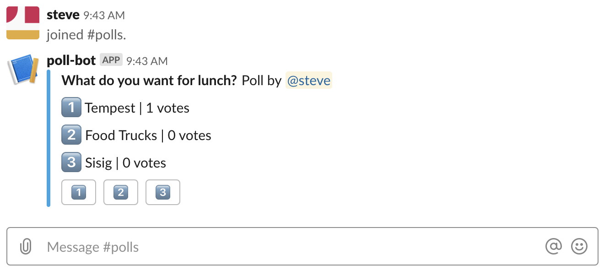
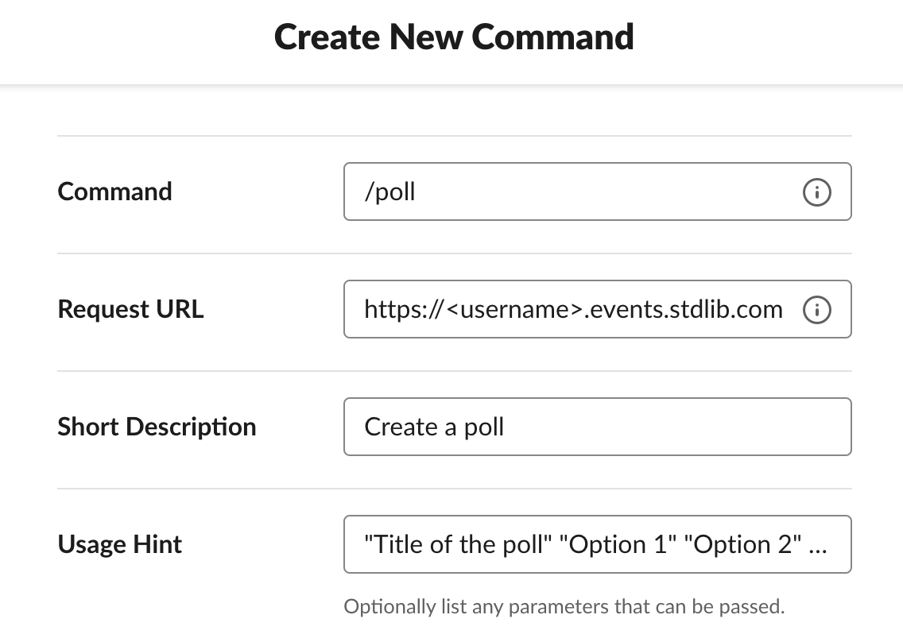

# Slack Polling App

This is a Slack + Airtable Application, written in Node.js,
on [Standard Library](https://stdlib.com), that lets you create polls in Slack with a slash command

## Deploying this Application

You can deploy this Slack App to [Standard Library](https://stdlib.com) by clicking this button:

Before you can deploy the app, you need to link your Airtable and Slack accounts.

### Airtable

Before you link your Airtable account, you need to create a base for this app. You can make one from a template
[here](https://airtable.com/addBaseFromShare/shrb5I2ktaaJBwv4C). Once you create a copy of the base. Click the **Link Resource** button. Make
sure you choose the base you just created when you are linking your account.

### Slack

Click **Link Resource** and follow the instructions to build and link a Slack app.

**Note:** Once deployed, you will still need to create the `/poll` command separately in your Slack app dashboard.
For the slash command's request URL, enter `https://<username>.events.stdlib.com/`.

### Creating your add_user Command on Slack

You can create your poll command by visiting [api.slack.com/apps](https://api.slack.com/apps),
selecting your app, then clicking **Slash commands** on the left sidebar.

Click **Create Command** and fill out your command information. You'll want to
use `/poll` as the command name and `https://<username>.events.stdlib.com/` as the
URL, where `<username>` is your Standard Library username.

Click **Save** in the bottom right to proceed.

**Note:** For your slash command to work, your bot needs to be in the channel its called from. You can invite your bot
to a channel by typing `@<bot_name>`.

# Thank You!

Please check out [Standard Library](https://stdlib.com/) or follow us on Twitter,
[@StdLibHQ](https://twitter.com/@StdLibHQ).
